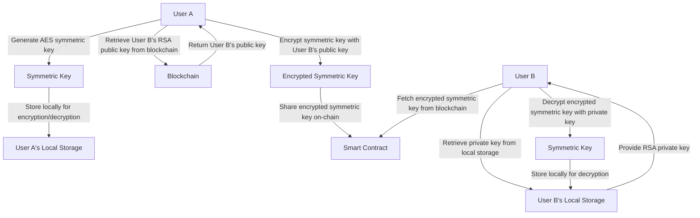
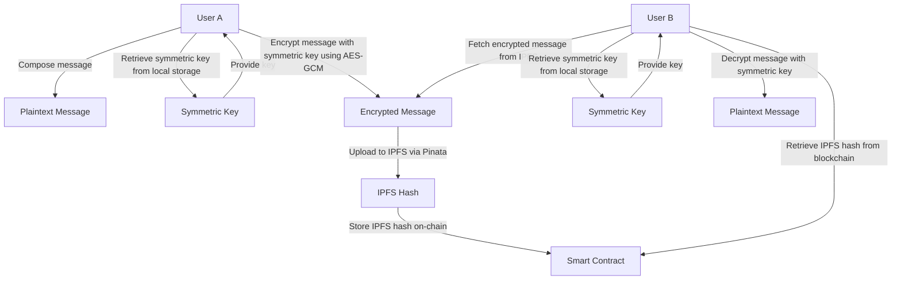
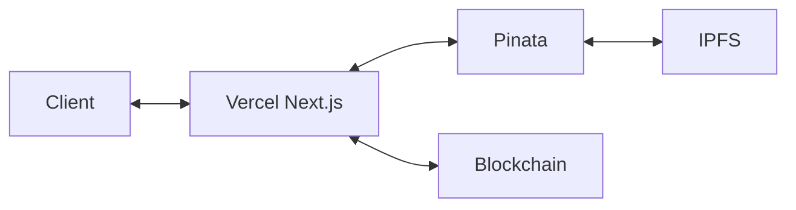

# ChitChat

**ChitChat** is a decentralized, encrypted messaging platform built on blockchain technology. It leverages IPFS for secure message storage and symmetric key sharing for end-to-end encryption, ensuring user privacy and data integrity. Built with Next.js 15, this DApp is deployed on Vercel, combining modern web technologies with decentralized principles.

---

## Table of Contents

- [Features](#features)
- [Architecture](#architecture)
- [Messaging Flow Chart](#messaging-flow-chart)
- [Installation and Setup](#installation-and-setup)
- [Usage Guide](#usage-guide)
- [Cloud Computing Usage](#cloud-computing-usage)
- [System Architecture Diagram](#system-architecture-diagram)
- [License](#license)
- [Contribution](#contribution)

---

## Features

- **User Registration**: Register with a display name and profile picture stored on IPFS.
- **Friend System**: Send, accept, or reject friend requests.
- **End-to-End Encrypted Messaging**: Messages are encrypted using symmetric keys and stored on IPFS.
- **Secure Key Exchange**: Symmetric keys are shared securely using RSA public-key cryptography.
- **Decentralized Storage**: Encrypted messages and profile pictures are stored on IPFS via Pinata.
- **Blockchain Management**: User relationships and message references are managed on-chain.

---

## Architecture

ChitChat integrates blockchain smart contracts, IPFS for decentralized storage, and client-side encryption to deliver a secure messaging experience:

- **Smart Contract**: Manages user profiles, friend relationships, and IPFS references for encrypted messages. It also facilitates encrypted symmetric key sharing.
- **IPFS and Pinata**: Stores and retrieves encrypted messages and profile pictures. Pinata provides an API for seamless IPFS interaction.
- **Client-side Encryption**: Messages are encrypted and decrypted locally using symmetric keys, with RSA encryption for secure key exchange.
- **Key Management**: RSA key pairs are generated client-side, with private keys stored locally and public keys shared on-chain. Symmetric keys are created per conversation and encrypted with friends' public keys.

---

## Messaging Flow Chart


### Symmetric Key Generation and Sharing

In this process, only User A generates the symmetric key, stores it locally, encrypts it with User B's public key, and shares it on-chain. User B retrieves and decrypts it using their private key.



**Clarification**:
- User A generates a single symmetric key per conversation.
- User A encrypts it with User B's RSA public key and shares it via the smart contract.
- User B fetches the encrypted key, decrypts it with their RSA private key (generated and stored locally during account creation), and stores the symmetric key locally.

---

## Encrypted Messaging

Once the symmetric key is shared, User A sends an encrypted message to User B, who retrieves and decrypts it using the shared symmetric key.



**Clarification**:
- User A encrypts the message with the symmetric key (AES-GCM) and uploads it to IPFS.
- The IPFS hash is stored on-chain, and User B retrieves it.
- User B uses the previously decrypted symmetric key to decrypt the message locally.

---

## Cryptography Topics Used in ChitChat

ChitChat leverages the following cryptographic concepts to ensure secure messaging:

- **RSA Public-Key Cryptography**: 
  - Used for secure symmetric key exchange.
  - Each user generates an RSA key pair (public and private keys) during account creation. The public key is shared on-chain, while the private key is stored locally.
  - The symmetric key is encrypted with the recipient's public key and decrypted with their private key.

- **AES-GCM Symmetric Encryption**: 
  - Employed for encrypting and decrypting messages.
  - Uses AES-256 in Galois/Counter Mode (GCM) for fast, secure, and authenticated encryption.
  - The same symmetric key is used by both sender and receiver for end-to-end encryption.

- **End-to-End Encryption**: 
  - Ensures that only the sender and receiver can read the messages.
  - Encryption and decryption occur client-side, preventing intermediaries (e.g., IPFS or blockchain) from accessing plaintext.

- **Key Management**: 
  - Involves generating and storing RSA key pairs locally, sharing public keys on-chain, and managing per-conversation symmetric keys.
  - Symmetric keys are securely exchanged via RSA encryption.

These techniques combine to provide privacy, integrity, and authenticity in ChitChat's decentralized messaging system.

## Installation and Setup

To run ChitChat locally, follow these steps:

1. **Clone the repository**:
   ```bash
   git clone https://github.com/yourusername/chitchat.git
   cd chitchat
   ```

2. **Install dependencies**:
   ```bash
   npm install
   ```

3. **Set up environment variables**:
   - Create a `.env.local` file in the root directory.
   - Add the following variables (replace with your own keys):
     ```
     PINATA_API_KEY=your_pinata_api_key
     PINATA_SECRET_API_KEY=your_pinata_secret_api_key
     NEXT_PUBLIC_BLOCKCHAIN_NETWORK=your_blockchain_network_endpoint
     ```

4. **Run the development server**:
   ```bash
   npm run dev
   ```

5. **Access the application**:
   - Open your browser and go to `http://localhost:3000`.

**Prerequisites**:
- Node.js and npm installed.
- A Web3 wallet (e.g., MetaMask) installed in your browser.

---

## Usage Guide

1. **Connect Your Wallet**: Use your Web3 wallet to connect to ChitChat.
2. **Register**: Enter a display name and upload a profile picture (stored on IPFS).
3. **Send Friend Requests**: Find other users and send friend requests.
4. **Accept Friend Requests**: Approve incoming requests to enable messaging.
5. **Share Symmetric Key**: After becoming friends, share an encrypted symmetric key.
6. **Send Messages**: Compose messages, which are encrypted and uploaded to IPFS.
7. **View Messages**: Retrieve and decrypt message history with your friends.

---

## Cloud Computing Usage

ChitChat leverages cloud computing to enhance usability and scalability while maintaining decentralization:

- **Vercel**:
  - Hosts the Next.js 15 application, providing a serverless environment for the frontend and API routes.
  - API routes (e.g., `/api/ipfs-auth/get` and `/api/ipfs-auth/upload`) handle interactions with Pinata, enabling seamless IPFS uploads and retrievals.
  - Offers automatic scaling, domain management, and easy deployment.

- **Pinata**:
  - A cloud-based IPFS pinning service that ensures encrypted messages and profile pictures remain accessible on IPFS.
  - Simplifies IPFS integration by providing a REST API, eliminating the need to run a local IPFS node.

- **Blockchain Network**:
  - While decentralized, the blockchain (e.g., Ethereum or Polygon) acts as a distributed ledger for smart contract execution, managing user data and message metadata in a trustless manner.

This combination of cloud services and decentralized technologies allows ChitChat to deliver a user-friendly experience without compromising security or privacy.

---

## System Architecture Diagram

The diagram below shows how the components of ChitChat interact:



- **Client**: The user interface running in the browser, handling encryption and decryption.
- **Vercel (Next.js)**: Hosts the app and serverless APIs for IPFS interactions.
- **Pinata**: Manages IPFS pinning and file access.
- **IPFS**: Stores encrypted data in a decentralized network.
- **Blockchain**: Executes the smart contract for user and message management.

---

## License

This project is licensed under the MIT License. See the [LICENSE](LICENSE) file for details.

---

## Contribution

We welcome contributions! To get started:

1. Fork the repository.
2. Create a branch for your feature or fix.
3. Commit your changes and push to your fork.
4. Submit a pull request with a clear description.

For bugs or feature requests, please open an issue on GitHub.
