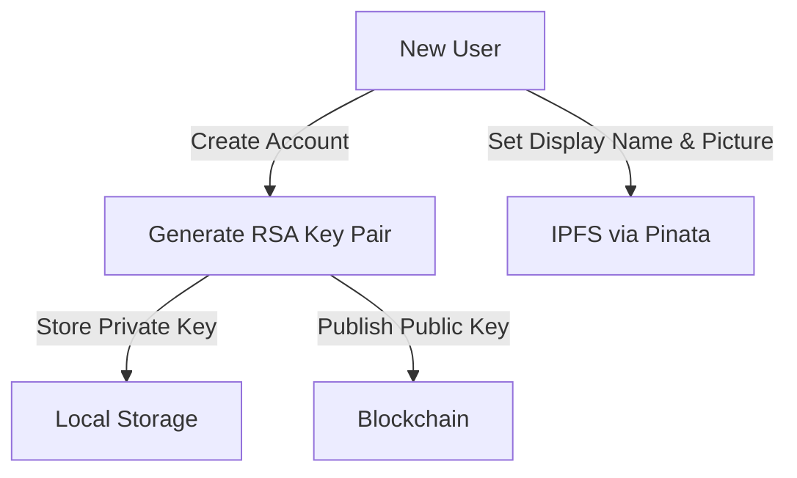
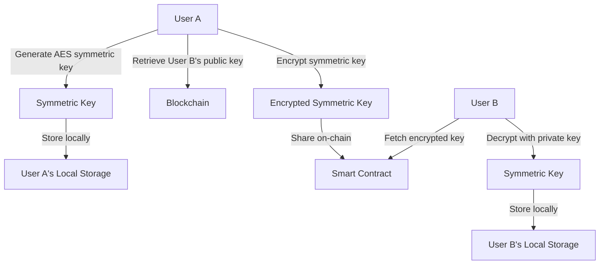
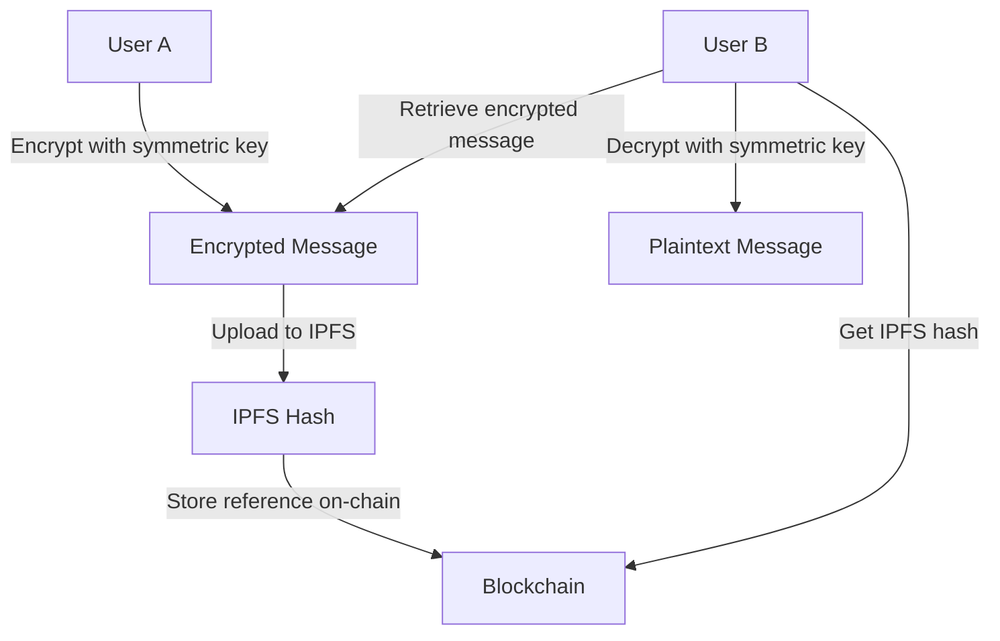

# ChitChat

[](LICENSE)
[](https://nextjs.org/)
[](https://ipfs.tech/)

**ChitChat** is a decentralized, end-to-end encrypted messaging platform that prioritizes privacy without sacrificing usability. Built on blockchain technology and IPFS, ChitChat ensures your conversations remain private, secure, and free from central control.


## ✨ Key Features

- **True End-to-End Encryption** — Messages are encrypted and decrypted locally using AES-256-GCM
- **Decentralized Architecture** — No central servers storing your messages or metadata
- **Blockchain-Powered** — Friend relationships and message references managed on-chain
- **IPFS Storage** — Encrypted messages and profile data stored on the InterPlanetary File System
- **Key Recovery** — Export/import system for symmetric and private keys
- **Modern UI** — Built with Next.js 15 for a responsive, fast user experience

## 🔒 Security Architecture

ChitChat employs a sophisticated hybrid cryptographic approach:

### User Registration & Key Generation


### Symmetric Key Exchange


### Secure Messaging


## 🚀 Getting Started

### Prerequisites
- Node.js (v18+)
- NPM or Yarn
- Web3 wallet (MetaMask recommended)
- Pinata API keys

### Installation

1. **Clone the repository**
   ```bash
   git clone https://github.com/yourusername/chitchat.git
   cd chitchat
   ```

2. **Install dependencies**
   ```bash
   npm install
   # or
   yarn install
   ```

3. **Configure environment variables**
   ```bash
   cp .env.example .env.local
   # Edit .env.local with your Pinata API keys and blockchain endpoint
   ```

4. **Run development server**
   ```bash
   npm run dev
   # or
   yarn dev
   ```

5. **Open your browser**
   Navigate to [http://localhost:3000](http://localhost:3000)

## 📱 Usage Guide

### First-Time Setup
1. Connect your Web3 wallet
2. Create your profile with display name and optional profile picture
3. Export and securely store your private and symmetric keys

### Adding Friends
1. Search for friends by their wallet address
2. Send friend requests
3. Accept incoming requests to establish secure communication

### Messaging
1. Select a friend from your contacts
2. Start sending end-to-end encrypted messages
3. Messages are encrypted locally, stored on IPFS, and only referenced on-chain

### Key Management
- Export keys after initial exchange
- Import keys if you switch devices
- Securely back up keys to prevent message loss

## 🔧 Technical Stack

- **Frontend**: Next.js 15, React, TailwindCSS
- **Blockchain**: Ethereum/Polygon Smart Contracts
- **Storage**: IPFS via Pinata Cloud
- **Deployment**: Vercel
- **Encryption**: AES-256-GCM (messages), RSA-2048 (key exchange)

## 🌐 Architecture Overview

ChitChat combines decentralized technologies with modern web practices:

- **Client-Side**: Handles all encryption/decryption locally in the browser
- **Blockchain Layer**: Manages user relationships and references to encrypted content
- **IPFS Layer**: Stores encrypted messages and profile data
- **Cloud Services**: Vercel for app hosting, Pinata for IPFS pinning

## 🤝 Contributing

We welcome contributions! Please read our [Contributing Guide](CONTRIBUTING.md) to get started.

1. Fork the repository
2. Create your feature branch (`git checkout -b feature/amazing-feature`)
3. Commit your changes (`git commit -m 'Add some amazing feature'`)
4. Push to the branch (`git push origin feature/amazing-feature`)
5. Open a Pull Request

## 📄 License

This project is licensed under the MIT License - see the [LICENSE](LICENSE) file for details.

## 📞 Contact

Project Link: [https://github.com/roudra323/chitchat](https://github.com/roudra323/Chitchat-DApp-Project)

---

Built with ❤️ for a decentralized future
